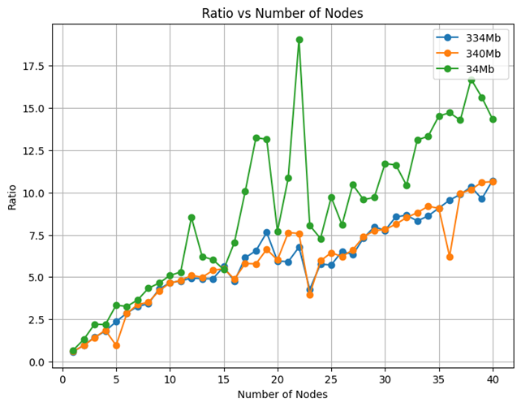
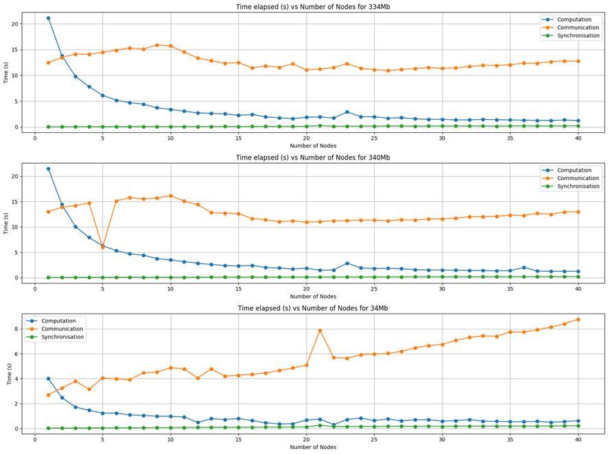
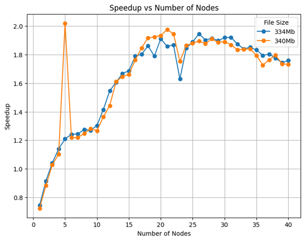
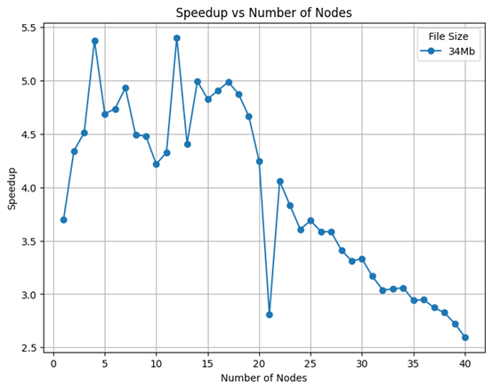

# MapReduce Implementation for Tokenization of Large Datasets - SLR207

## Project Overview
This project implements a distributed computing framework using the MapReduce pattern to extract tokens from large datasets and sort them by frequency. Simulations across up to 40 servers were then conducted to collect data for comparison with Amdahl's Law.

The communication between nodes is achieved using File Transfer Protocol (FTP) for data transfer and sockets for control signaling. The master node orchestrates the process by sending data splits to each worker node via FTP, while also managing node coordination through socket communication. 

The project leverages Java for implementation, using the Maven build tool to manage dependencies and create executable JAR files for deployment across multiple nodes. 

## Detailed description of the implementation

In this implementation, a **master node** orchestrates the entire process, sending splits of data to **worker nodes**, performing **map** and **reduce** functions, and finally aggregating the results.

Below are the phases implemented in the project:

**MAP1**: The map function in each node separates the keys from the splits, calculates **(hash of the key) % (number of nodes) + 1**, which determines the file in which it will be written and the machine identifier to which this **(key, value)** pair (the value is always 1) should be sent.

**SHUFFLE1**: In the shuffle phase, the files with the **(keys, values)** are sent to the corresponding node via **FTP**. Then, a **"I'm finished MAP+Sending"** message is sent to the master via **socket**. Once the master has received this message from all nodes, it sends the **"Continue reduce"** message.

**REDUCE1**: The nodes execute the reduce function, which consists of counting the number of occurrences of each key. After that, the nodes send the keys and their respective number of occurrences to the master via **socket**.

**MAP2**: The master calculates the groups based on the **min value**, **max value**, and **number of nodes**, and then sends each node the corresponding group (the group contains the possible values of the number of occurrences handled by the node).

**SHUFFLE2**: The nodes send the **(keys, number of occurrences)** to the nodes defined by the master (a second shuffle) and then signal to the master with another message.

**REDUCE2**: Once the master has received this signal from all nodes, it sends the **"Continue second reduce"** message. The nodes, upon receiving this message, execute the second reduce, which consists of sorting the pairs by the number of occurrences (in alphabetical order). Finally, the nodes write their pairs into a file in a sorted manner.

### Space-Time Diagram
Below is a simplified sequence of operations demonstrating the interaction between the master and worker nodes during the MapReduce process:

## Results

Below are the graphs obtained with the experiments. 

### Ratio vs Number of Nodes
The ratio is (communication + synchronization)/computation on the y axis and the number of nodes on the x axis. 

### Total time elapsed in seconds vs number of nodes

### Time elapsed in seconds for computation, communication, and synchronization vs number of nodes

### Speedup vs Number of nodes for 334, 340 Mb, and 34 Mb

## Amdahl’s law

Amdahl's law states that the maximum improvement to a system's performance is limited by the portion of the system that cannot be parallelized. Therefore, as the number of nodes increases, the impact of the non-parallelizable portion becomes more significant, leading to diminishing returns on performance gains. 

As shown in the graph of Speedup vs. Number of Servers, the Speedup metric increases as the number of nodes increases from 1 to 20, indicating that the system's performance improves with additional nodes up to a certain point. However, the curve plateaus between 20 and 40 nodes, demonstrating the expected behavior predicted by Amdahl's law. This empirical data supports the theoretical prediction, validating Amdahl's law in our system.

